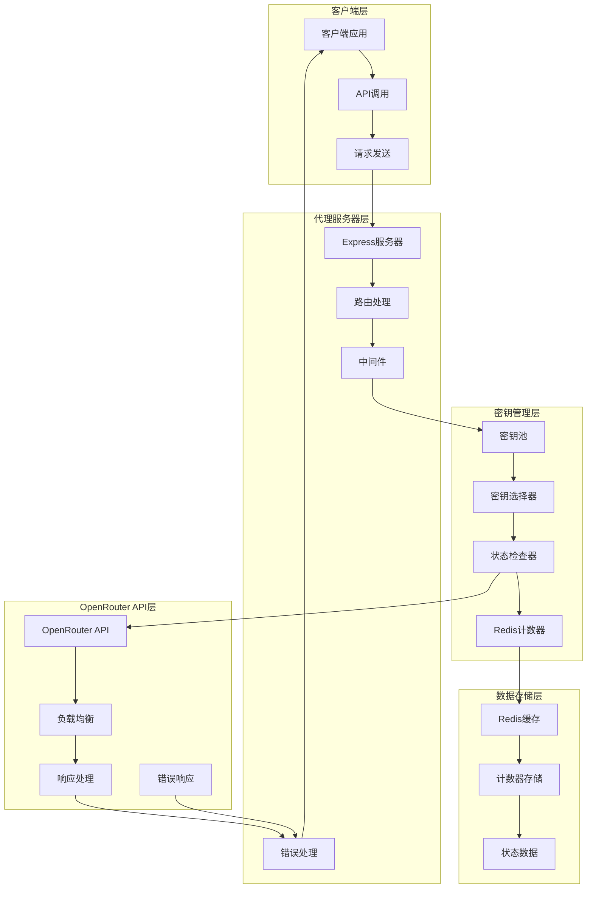
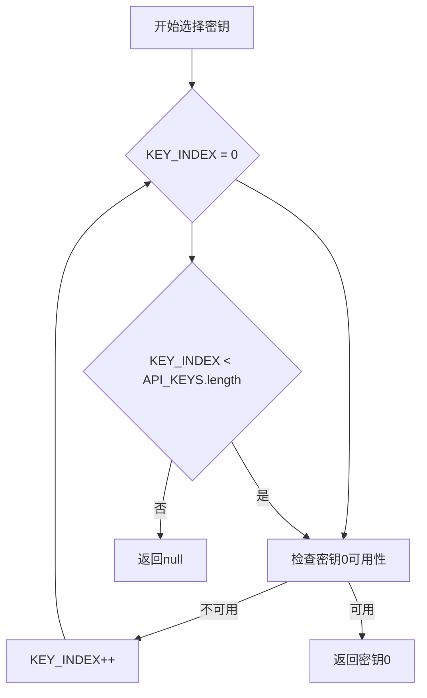
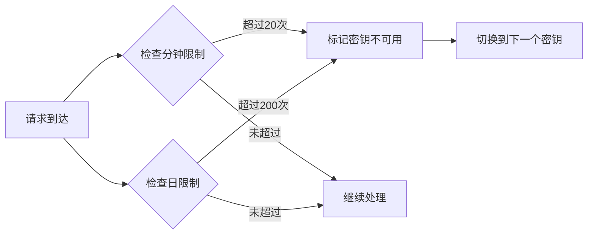
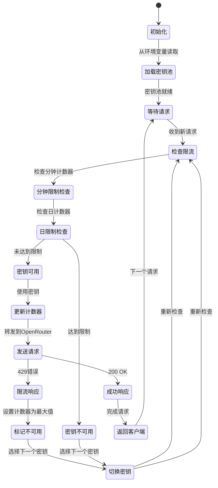
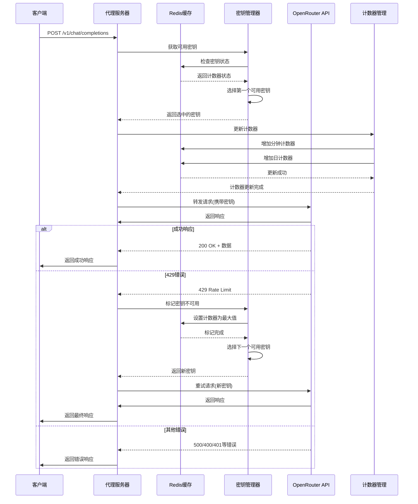
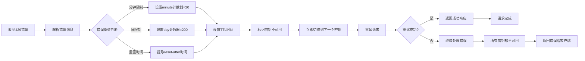
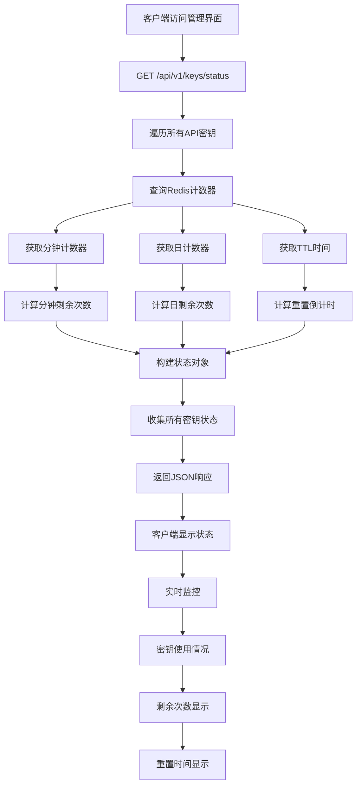
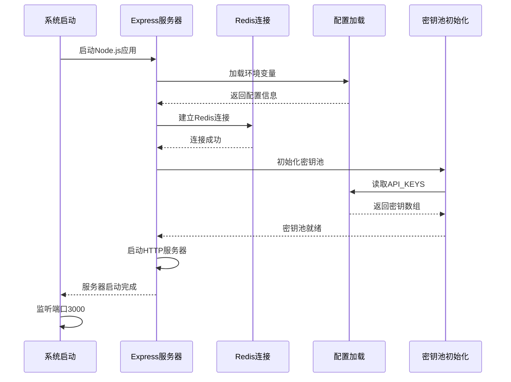

# 📚 OpenRouter 免费代理服务器 - 完整技术文档

## 📋 文档目录

1. [项目概述](#项目概述)
2. [系统架构](#系统架构)
3. [密钥管理系统](#密钥管理系统)
4. [限流系统](#限流系统)
5. [请求处理流程](#请求处理流程)
6. [错误处理机制](#错误处理机制)
7. [监控与管理](#监控与管理)
8. [部署与配置](#部署与配置)
9. [API 接口文档](#api接口文档)
10. [故障排除](#故障排除)

---

## 🎯 项目概述

### 项目简介

OpenRouter 免费代理服务器是一个智能的 API 代理服务，用于将 OpenRouter 的免费 API 请求智能分发到多个免费 API 密钥，实现负载均衡和限流管理。

### 核心特性

- **智能密钥管理**: 自动选择和切换 API 密钥
- **精确限流控制**: 20 次/分钟 + 200 次/日的双限制
- **高可用性**: 429 错误自动恢复和密钥切换
- **完整监控**: 实时状态查询和日志记录
- **高性能**: Redis 缓存和异步处理
- **易部署**: 简单的配置和启动流程

### 技术栈

- **后端**: Node.js + Express
- **缓存**: Redis
- **API**: OpenRouter API
- **前端**: EJS 模板引擎

---

## 🏗️ 系统架构

### 整体架构图



### 核心组件说明

#### 1. Express 服务器

- **端口**: 3000
- **主要功能**: 处理 HTTP 请求，路由分发，中间件管理
- **文件位置**: [`src/index.js`](docs/src/index.js)

#### 2. 密钥管理器

- **功能**: 管理多个 API 密钥，选择可用密钥
- **存储**: 环境变量配置
- **选择策略**: 顺序选择第一个可用密钥

#### 3. Redis 缓存

- **功能**: 存储计数器，跟踪密钥使用情况
- **数据结构**:
  - `${apiKey}:minute` - 分钟计数器
  - `${apiKey}:day` - 日计数器
- **TTL 设置**: 分钟计数器 60 秒，日计数器 86400 秒

#### 4. OpenRouter API 接口

- **端点**: `https://openrouter.ai/api/v1/chat/completions`
- **认证**: Bearer Token
- **限流**: 20 次/分钟，200 次/日

---

## 🔑 密钥管理系统

### 密钥池配置

```javascript
// 从环境变量读取密钥池
const API_KEYS = process.env.OPENROUTER_API_KEYS.split(",");
const KEY_INDEX = 0; // 当前使用的密钥索引
```

### 环境变量配置

```bash
# .env 文件示例
OPENROUTER_API_KEYS=sk-abc123...,sk-def456...,sk-ghi789...
PORT=3000
REDIS_URL=redis://localhost:6379
```

### 密钥选择机制

```javascript
// 获取可用密钥的核心逻辑
function getAvailableApiKey() {
    for (let i = 0; i < API_KEYS.length; i++) {
        const key = API_KEYS[KEY_INDEX];

        // 检查Redis计数器
        const minuteCount = await redisClient.get(`${key}:minute`);
        const dayCount = await redisClient.get(`${key}:day`);

        // 判断是否可用
        if ((minuteCount && parseInt(minuteCount) >= 20) ||
            (dayCount && parseInt(dayCount) >= 200)) {
            logger.debug(`Skipping key ${key.substring(0, 10)}... (minute: ${minuteCount}, day: ${dayCount})`);
            continue;  // 跳过不可用密钥
        }

        return key;  // 返回第一个可用密钥
    }
    return null;  // 所有密钥都不可用
}
```

### 密钥选择流程图



### 密钥状态跟踪

```javascript
// Redis计数器管理
async function updateRateLimitCounter(apiKey) {
  const now = Date.now();

  // 更新分钟计数器
  const minuteKey = `${apiKey}:minute`;
  const currentMinuteCount = await redisClient.get(minuteKey);
  await redisClient.incr(minuteKey);
  await redisClient.expire(minuteKey, 60); // 60秒TTL

  // 更新日计数器
  const dayKey = `${apiKey}:day`;
  const currentDayCount = await redisClient.get(dayKey);
  await redisClient.incr(dayKey);
  await redisClient.expire(dayKey, 86400); // 24小时TTL

  logger.debug(
    `Updated counters for ${apiKey.substring(
      0,
      10
    )}... - minute: ${currentMinuteCount}->${
      parseInt(currentMinuteCount || 0) + 1
    }, day: ${currentDayCount}->${parseInt(currentDayCount || 0) + 1}`
  );
}
```

---

## ⏱️ 限流系统

### 双限制机制



### 限流阈值

- **分钟限制**: 20 次/分钟
- **日限制**: 200 次/日
- **重置时间**: 次日 UTC 00:00 自动重置

### 429 错误处理

```javascript
// 429错误处理完整流程
async function handleRateLimitError(apiKey, errorMessage) {
  let ttlSeconds = 3600; // 默认1小时

  // 根据错误类型设置计数器为最大值
  if (errorMessage.includes("free-models-per-minute")) {
    ttlSeconds = 60; // 分钟限制：60秒
    await redisClient.setEx(`${apiKey}:minute`, ttlSeconds, "20"); // 设为最大值20
    logger.info(
      `Marked key ${apiKey.substring(0, 10)}... as minute limit reached`
    );
  } else if (errorMessage.includes("free-models-per-day")) {
    ttlSeconds = 86400; // 日限制：24小时
    await redisClient.setEx(`${apiKey}:day`, ttlSeconds, "200"); // 设为最大值200
    logger.info(
      `Marked key ${apiKey.substring(0, 10)}... as daily limit reached`
    );
  } else if (errorMessage.includes("reset-after")) {
    // 从错误消息中提取重置时间
    const match = errorMessage.match(/reset-after:\s*(\d+)/);
    if (match) {
      ttlSeconds = parseInt(match[1]);
    }
  }

  logger.info(
    `Marked key ${apiKey.substring(
      0,
      10
    )}... as rate limited for ${ttlSeconds}s`
  );
}
```

### 限流系统状态图



---

## 🔄 请求处理流程

### 完整请求链路



### 请求处理核心代码

```javascript
// 主要请求处理函数
app.post("/v1/chat/completions", async (req, res) => {
  let lastError = null;

  // 尝试所有可用的API密钥
  for (let i = 0; i < API_KEYS.length; i++) {
    const apiKey = getAvailableApiKey();

    if (!apiKey) {
      logger.warn("No available API keys");
      return res.status(429).json({ error: "All API keys are rate limited" });
    }

    try {
      // 更新计数器
      await updateRateLimitCounter(apiKey);

      // 转发请求到OpenRouter
      const response = await fetch(
        "https://openrouter.ai/api/v1/chat/completions",
        {
          method: "POST",
          headers: {
            Authorization: `Bearer ${apiKey}`,
            "Content-Type": "application/json",
            "HTTP-Referer": "http://localhost:3000",
            "X-Title": "OpenRouter Free Pool",
          },
          body: JSON.stringify(req.body),
        }
      );

      // 处理响应
      if (response.status === 200) {
        const data = await response.json();
        return res.json(data);
      } else if (response.status === 429) {
        // 处理429错误
        const errorData = await response.json();
        const errorMessage = errorData.error?.message || "Rate limit exceeded";
        await handleRateLimitError(apiKey, errorMessage);
        lastError = new Error("Rate limit exceeded, trying next key");
        continue; // 尝试下一个密钥
      } else {
        // 处理其他错误
        const errorData = await response.json();
        logger.error(
          `OpenRouter error: ${response.status} - ${JSON.stringify(errorData)}`
        );
        return res.status(response.status).json(errorData);
      }
    } catch (error) {
      logger.error(
        `Error with key ${apiKey.substring(0, 10)}...: ${error.message}`
      );
      lastError = error;
      continue; // 尝试下一个密钥
    }
  }

  // 所有密钥都失败
  if (lastError) {
    return res.status(429).json({ error: lastError.message });
  }

  return res.status(500).json({ error: "Unknown error occurred" });
});
```

---

## 🚨 错误处理机制

### 429 错误处理流程



### 错误类型处理

```javascript
// 错误类型映射
const ERROR_HANDLERS = {
  "free-models-per-minute": {
    ttl: 60,
    maxCount: 20,
    message: "Minute limit reached",
  },
  "free-models-per-day": {
    ttl: 86400,
    maxCount: 200,
    message: "Daily limit reached",
  },
  "reset-after": {
    ttl: null, // 从错误消息中提取
    maxCount: null,
    message: "Custom reset time",
  },
};
```

### 错误恢复机制

```javascript
// 自动恢复逻辑
async function handleRateLimitError(apiKey, errorMessage) {
  let ttlSeconds = 3600;

  // 根据错误类型处理
  if (errorMessage.includes("free-models-per-minute")) {
    ttlSeconds = 60;
    await redisClient.setEx(`${apiKey}:minute`, ttlSeconds, "20");
  } else if (errorMessage.includes("free-models-per-day")) {
    ttlSeconds = 86400;
    await redisClient.setEx(`${apiKey}:day`, ttlSeconds, "200");
  } else if (errorMessage.includes("reset-after")) {
    const match = errorMessage.match(/reset-after:\s*(\d+)/);
    if (match) {
      ttlSeconds = parseInt(match[1]);
    }
  }

  logger.info(
    `Marked key ${apiKey.substring(
      0,
      10
    )}... as rate limited for ${ttlSeconds}s`
  );
}
```

---

## 📊 监控与管理

### 状态查询接口

```javascript
// /api/v1/keys/status 端点
app.get("/api/v1/keys/status", async (req, res) => {
  const status = await Promise.all(
    API_KEYS.map(async (key) => {
      const minuteCount = await redisClient.get(`${key}:minute`);
      const dayCount = await redisClient.get(`${key}:day`);

      return {
        key: key.substring(0, 10) + "...",
        minute: {
          used: minuteCount ? parseInt(minuteCount) : 0,
          remaining: minuteCount ? Math.max(0, 20 - parseInt(minuteCount)) : 20,
          resetIn: minuteTTL > 0 ? minuteTTL : null,
        },
        day: {
          used: dayCount ? parseInt(dayCount) : 0,
          remaining: dayCount ? Math.max(0, 200 - parseInt(dayCount)) : 200,
          resetIn: dayTTL > 0 ? dayTTL : null,
        },
        available: !(minuteCount >= 20 || dayCount >= 200),
      };
    })
  );

  res.json({ keys: status });
});
```

### 状态查询响应示例

```json
{
  "keys": [
    {
      "key": "sk-abc123...",
      "minute": {
        "used": 15,
        "remaining": 5,
        "resetIn": 1200
      },
      "day": {
        "used": 180,
        "remaining": 20,
        "resetIn": 3600
      },
      "available": true
    },
    {
      "key": "sk-def456...",
      "minute": {
        "used": 20,
        "remaining": 0,
        "resetIn": 45
      },
      "day": {
        "used": 200,
        "remaining": 0,
        "resetIn": 7200
      },
      "available": false
    }
  ]
}
```

### 管理界面监控流程



---

## 🚀 部署与配置

### 环境要求

- **Node.js**: 14.x 或更高版本
- **Redis**: 6.x 或更高版本
- **npm**: 6.x 或更高版本

### 安装步骤

```bash
# 1. 克隆项目
git clone <repository-url>
cd openrouter-free-pool

# 2. 安装依赖
npm install

# 3. 配置环境变量
cp .env.example .env
# 编辑 .env 文件，添加API密钥

# 4. 启动Redis服务
# 根据系统启动Redis

# 5. 启动应用
npm start
```

### Docker 部署

```yaml
# docker-compose.yml
version: "3.8"
services:
  app:
    build: .
    ports:
      - "3000:3000"
    environment:
      - NODE_ENV=production
      - OPENROUTER_API_KEYS=${OPENROUTER_API_KEYS}
      - REDIS_URL=redis://redis:6379
    depends_on:
      - redis
    restart: unless-stopped

  redis:
    image: redis:7-alpine
    ports:
      - "6379:6379"
    restart: unless-stopped
```

### 配置文件说明

```bash
# .env 文件配置
OPENROUTER_API_KEYS=sk-abc123...,sk-def456...,sk-ghi789...  # OpenRouter API密钥，多个密钥用逗号分隔
PORT=3000                                                   # 服务端口
REDIS_URL=redis://localhost:6379                           # Redis连接URL
NODE_ENV=development                                        # 运行环境
```

### 系统启动流程



---

## 🔌 API 接口文档

### 1. 聊天完成接口

**端点**: `POST /v1/chat/completions`
**描述**: 转发聊天请求到 OpenRouter API

**请求体**:

```json
{
  "model": "gpt-3.5-turbo",
  "messages": [
    {
      "role": "user",
      "content": "Hello, how are you?"
    }
  ]
}
```

**响应**:

```json
{
  "id": "chatcmpl-123",
  "object": "chat.completion",
  "created": 1677652288,
  "model": "gpt-3.5-turbo",
  "choices": [
    {
      "index": 0,
      "message": {
        "role": "assistant",
        "content": "I'm doing well, thank you for asking!"
      },
      "finish_reason": "stop"
    }
  ],
  "usage": {
    "prompt_tokens": 20,
    "completion_tokens": 10,
    "total_tokens": 30
  }
}
```

### 2. 密钥状态查询接口

**端点**: `GET /api/v1/keys/status`
**描述**: 查询所有 API 密钥的使用状态

**响应**:

```json
{
  "keys": [
    {
      "key": "sk-abc123...",
      "minute": {
        "used": 15,
        "remaining": 5,
        "resetIn": 1200
      },
      "day": {
        "used": 180,
        "remaining": 20,
        "resetIn": 3600
      },
      "available": true
    }
  ]
}
```

### 3. 健康检查接口

**端点**: `GET /health`
**描述**: 检查服务运行状态

**响应**:

```json
{
  "status": "ok",
  "timestamp": "2024-01-01T00:00:00.000Z",
  "version": "1.0.0"
}
```

---

## 🛠️ 故障排除

### 常见问题

#### 1. 所有密钥都不可用

**问题**: 返回 "All API keys are rate limited"
**原因**: 所有密钥都达到了限流限制
**解决**:

- 等待 Redis 计数器自动重置
- 检查 OpenRouter 账户状态
- 添加更多 API 密钥

#### 2. Redis 连接失败

**问题**: Error connecting to Redis
**原因**: Redis 服务未启动或连接配置错误
**解决**:

```bash
# 检查Redis服务状态
redis-cli ping

# 启动Redis服务
redis-server

# 检查连接配置
REDIS_URL=redis://localhost:6379
```

#### 3. 429 错误频繁

**问题**: 经常收到 429 错误
**原因**: 请求频率过高
**解决**:

- 降低请求频率
- 增加 API 密钥数量
- 实现请求队列机制

#### 4. 密钥无效

**问题**: 返回 401 Unauthorized
**原因**: API 密钥无效或过期
**解决**:

- 检查 OpenRouter 账户状态
- 更新 API 密钥
- 重新配置环境变量

### 日志分析

```javascript
// 查看详细日志
tail -f logs/app.log

// 过滤错误日志
grep "error" logs/app.log

// 查看密钥切换日志
grep "Marked key" logs/app.log
```

### 性能监控

```javascript
// 监控Redis内存使用
redis-cli info memory

// 监控API调用统计
redis-cli keys "*:minute" | wc -l

// 监控响应时间
curl -w "@curl-format.txt" -o /dev/null -s http://localhost:3000/health
```

### 调试模式

```bash
# 启用调试模式
DEBUG=* npm start

# 启用特定模块调试
DEBUG=express:* npm start

# 启用Redis调试
DEBUG=redis:* npm start
```

---

## 📈 性能优化

### Redis 优化

```javascript
# Redis配置优化
maxmemory 2gb
maxmemory-policy allkeys-lru
timeout 300
tcp-keepalive 60
```

### 应用优化

```javascript
# 连接池配置
const redisClient = createClient({
  url: process.env.REDIS_URL,
  socket: {
    reconnectStrategy: (retries) => Math.min(retries * 50, 500),
  },
});

# 请求超时配置
app.use(express.json({ limit: '10mb' }));
app.use(express.urlencoded({ extended: true, limit: '10mb' }));
```

### 缓存策略

```javascript
# 实现响应缓存
const cache = new Map();

async function getCachedResponse(key) {
  if (cache.has(key)) {
    return cache.get(key);
  }
  return null;
}

async function setCachedResponse(key, value, ttl = 300) {
  cache.set(key, value);
  setTimeout(() => cache.delete(key), ttl * 1000);
}
```

---

## 🎯 总结

这个 OpenRouter 免费代理服务器实现了：

1. **智能密钥管理**: 自动选择和切换 API 密钥
2. **精确限流控制**: 20 次/分钟 + 200 次/日的双限制
3. **高可用性**: 429 错误自动恢复和密钥切换
4. **完整监控**: 实时状态查询和日志记录
5. **高性能**: Redis 缓存和异步处理
6. **易部署**: 简单的配置和启动流程

通过这个系统，用户可以最大化利用 OpenRouter 的免费 API 额度，同时获得稳定可靠的代理服务。

---

## 📚 附录

### A. 环境变量模板

```bash
# .env.example
OPENROUTER_API_KEYS=sk-abc123...,sk-def456...,sk-ghi789...
PORT=3000
REDIS_URL=redis://localhost:6379
NODE_ENV=development
LOG_LEVEL=info
```

### B. Dockerfile

```dockerfile
FROM node:18-alpine

WORKDIR /app

COPY package*.json ./
RUN npm ci --only=production

COPY . .

EXPOSE 3000

CMD ["npm", "start"]
```

### C. .gitignore

```
node_modules/
npm-debug.log*
yarn-debug.log*
yarn-error.log*
.env
.env.local
.env.development.local
.env.test.local
.env.production.local
logs/
*.log
.DS_Store
.vscode/
.idea/
```

### D. 开发脚本

```json
{
  "scripts": {
    "start": "node src/index.js",
    "dev": "nodemon src/index.js",
    "test": "jest",
    "lint": "eslint src/",
    "format": "prettier --write src/"
  }
}
```

### E. 部署清单

- [ ] 配置环境变量
- [ ] 启动 Redis 服务
- [ ] 安装依赖包
- [ ] 启动应用服务
- [ ] 配置反向代理（可选）
- [ ] 设置监控告警
- [ ] 配置日志轮转

---

- **文档版本**: 1.0.0
- **最后更新**: 2024-01-01
- **维护者**: OpenRouter Free Pool Team
